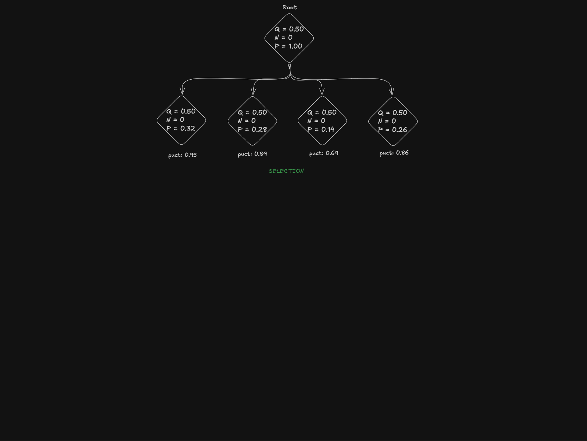
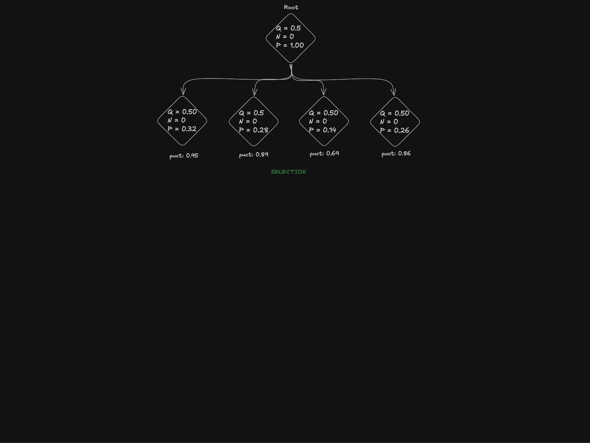

# CPU MCTS Tutorial

> [!NOTE]
> This tutorial assumes you already have a functional chess engine skeleton, including UCI support and a reliable legal copy-make move generator. Please note that the structures and practices demonstrated in this guide may not be perfectly optimized; the primary focus is to present the core concepts in their simplest and most accessible form. This repository contains the code of a simple mcts engine, with piece count evaluation and uniform policy network replacement. Note that some of the features in the code might degrade the engine strength due to poor quality of evaluation and policy.

## Content
- [Basics of MCTS](#basics-of-mcts)
    - [Alpha-Beta vs MCTS](#alpha-beta-vs-mcts)
    - [4 Iteration Stages](#4-iteration-stages)
        - [Selection](#selection)
        - [Expansion](#expansion)
        - [Simulation](#simulation)
        - [Backpropagation](#backpropagation)
        - [Example](#examples)
    - [Best Move](#best-move)
    - [Basic Implementation](#basic-implementation)
- [Additional features](#additional-features)
    - [Expansion on second visit](#expansion-on-second-visit)
    - [Mate proving](#mate-proving)
    - [Tree reuse](#tree-reuse)
    - [FPU](#fpu)
    - [Root Cpuct](#root-cpuct)
    - [Exploration scaling](#exploration-scaling)
    - [Policy Softmax Temperature](#policy-softmax-temperature)
- [And Beyond](#and-beyond)

## Basics of MCTS
### Alpha-Beta vs MCTS
Unlike Alpha-Beta depth-first algorithm, that tries to search each move to fixed depth, pruning majority of branches through clever heuristics, MCTS is best-first. Over duration of the search it builds the game tree in memory and keep tracks of visits and results to each node of the tree. The cool part is that it doesn’t search in a fixed order. In one iteration, it might be diving 20 moves deep into a promising line, in the next, it might jump back to check a move at depth 2, and then suddenly go down a third path to depth 40. As the effect of this, MCTS might dive very deep on what it seems to be a best line, while keeping seemingly bad lines very shallow. This allows MCTS to shine in very complex strategic positions, but might make it blind to surprising tactics.

### 4 Iteration Stages
MCTS works by repeating a search loop over and over until certain conditions are met. These repetitions are called iterations. Generally, the more iterations the system performs, the higher the quality of the final result. Each iteration consists of four primary stages:

#### Selection
The first step of an iteration is Selection. In this stage, we choose the move that has the highest score according to our formula. The current state of the art formula for MCTS in chess is PUCT (Predictor + Upper Confidence Bound for Trees):

$$ score = Q + C_{puct} \times P \times  \frac{\sqrt{max(N, 1)}}{n + 1}$$

**How it works:** <br>

The total score is the sum of two parts:
1. **Score ($Q$)**: This is the current average score of the child node. It represents how good we think the move is based on previous simulations.
2. **Exploration factor**:
    - **$C_{puct}$**: A constant (usually around $\sqrt{2}$) that controls how much the engine explores.
    - **$P$ (Policy or Predictor)**: The intuition provided by the neural network about how likely a move is to be good.
    - **The Visit Factor ($\frac{\sqrt{N}}{n + 1}$)**: This uses the number of parent visits ($N$) and child visits ($n$).

This formula ensures a balance: the engine chooses moves that have a high score $Q$, but it also tries moves that have not been visited very often yet. This prevents the engine from missing a potentially great move just because it hasn't looked at it deeply.

Here is example implementation in Rust:
```rust
//Returns index of a selected node
fn select(parent_idx: usize, tree: &Tree) -> usize {
    //Approx sqrt(2), it's good default value, but you want to spsa it later
    const C: f32 = 1.41;

    let parent_node = &tree[parent_idx];

    let mut best_node = parent_node.children[0];
    let mut best_score = f32::NEG_INFINITY;

    for &child_idx in parent_node.children.iter() {
        let child = &tree[child_idx];

        let q = if child.visits == 0 {
            //We don't have any information about this child, so we assume it's neutral
            0.5
        } else {
            child.score / child.visits as f32
        };

        let p = child.policy;
        let expl_factor = (parent_node.visits.max(1) as f32).sqrt() / (child.visits as f32 + 1.0);

        let score = q + C * p * expl_factor;

        if score > best_score {
            best_node = child_idx;
            best_score = score;
        }
    }

    return best_node;
}
```

#### Expansion
Second stage of the iteration, Expansion, happens when we reach the leaf of the tree. This stage might not happen in the iteration, if we land on the already explored terminal node. When that happens we just skip to the stage 3, Simulation. When we do land on the leaf node though, we expand the node by generating all legal moves in the position, packing it into the node structs and pushing it to the tree. This is where we label the nodes with policy, therefore limiting the amount of times we expand a node would bring high levels of performance improvement. One of those big improvements is expanding the node on the second visit, but I will talk about it later.

Here is example implementation in Rust:
```rust
fn expand(parent_idx: usize, position: &ChessPosition, tree: &mut Tree) {
    let mut legal_moves = Vec::new();
    position.board().map_legal_moves(|mv| legal_moves.push(mv));

    let policy = 1.0 / legal_moves.len() as f32;

    for mv in legal_moves {
        let new_node_idx = tree.push_node(&Node { 
            score: 0.0, 
            visits: 0, 
            policy, 
            mv, 
            result: GameResult::Ongoing, 
            children: Vec::new() 
        });

        tree[parent_idx].children.push(new_node_idx);
    }
}
```

#### Simulation
The third step of the iteration starts after we expand the node or if we have selected a terminal node. In a classic Monte Carlo Tree Search, this is where you would normally perform random moves until the very end of the game, relying on thousands of simulations to find the right path through statistical probability. However, for chess, we skip the "Monte Carlo" part and use a deterministic evaluator instead. In this specific project, I used a material counting system passed through a sigmoid function. This ensures the evaluation stays in a range from 0 to 1, which matches the rest of the engine's architecture. During this step, if it is the first time we are visiting the node, we check to see if the position is terminal. If the node is terminal, we return the specific terminal score for a win, loss, or draw. Otherwise, we simply return the score provided by our evaluator.

Here is example implementation in Rust:
```rust
fn simulate(node_idx: usize, position: &ChessPosition, tree: &mut Tree) -> f32 {
    
    //If it's the first time we evaluate the node, we want to check it's terminal state
    if tree[node_idx].visits == 0 {
        let mut possible_moves = 0;
        position.board().map_legal_moves(|_| possible_moves += 1);

        let key = position.board().hash();
        let is_draw =  position.board().half_moves() >= 100 
                || position.board().is_insufficient_material() 
                || position.history().get_repetitions(key) >= 2;

        let result = if possible_moves == 0 {
            if position.board().is_in_check() {
                GameResult::Lose(0)
            } else {
                GameResult::Draw
            }
        } else if is_draw {
            GameResult::Draw
        } else {
            GameResult::Ongoing
        };

        tree[node_idx].result = result;
    }

    match tree[node_idx].result {
        GameResult::Draw => 0.5,
        GameResult::Lose(_) => 0.0,
        GameResult::Win(_) => 1.0,
        _ => {
            //Sigmoid of material count to make sure that score is from 0 to 1
            1.0 / (1.0 + (material_count(position.board()) as f32 / -400.0).exp())
        }
    }
}
```

#### Backpropagation
The final stage of the iteration is Backpropagation. In this step, we travel from the newly expanded node all the way back up to the root of the tree. Along the way, we update every node we visited during the selection phase by increasing its visit count and adding to its total score.It is important to remember that chess is a zero-sum game, so we must account for the changing perspective between players. When we pass the score back up, we flip it using the formula $1 - \text{score}$. For example, if a move results in a high score of $0.9$ (a near-win for White), the previous node—representing Black’s turn—must record this as $0.1$ (a near-loss for Black). By oscillating the score this way as we move up the tree, we ensure that the selection formula in the next iteration always picks the best move for the player whose turn it is.

Here is example implementation in Rust:
```rust
fn backpropagate(node_idx: usize, score: &mut f32, tree: &mut Tree) {
    
    //We reverse the score from the very start, to make sure that nodes store score from opposite POV,
    //so we can use it directly in the puct, without the need to flip it there
    *score = 1.0 - *score;

    tree[node_idx].score += *score;
    tree[node_idx].visits += 1;
}   
```

#### Example
Here is a gif as an example of entire iteration process:



You can see here clearly, as node with highest puct score gets selected, expanded, the score is backpropagated with oscillating POV. All nodes start with score of 0.5, as it represents neutral state of node that we know nothing about.

First iteration simulation gave result of 0.5, effectively a draw, but you can see that puct still dropped, due to increased amount of visits to this child. Puct of other children did not change because we are using max() function on the parent visits.

In the second iteration you can see that simulation resulted in a win (1.0). After we backpropagated the reverse of the score to the parent, not only its visits increased but also score went down a lot, causing puct to drop massively. But then it increased a bit as parent (root node) visits also increased.

Mind that simulation here is reverse of the output of the eval method, to make sure that we are selecting the correct node. If we were to just use pure output from the node POV, we would have to select the node with lowest puct score, but that would break the formula, or just reverse the score in the selection code.

### Best Move
Once the search is finished, we need to select the best move to play. Engines like Leela Chess Zero (Lc0) typically choose the move with the highest number of visits. However, in CPU-based MCTS implementation, selecting the move with the highest average score seems to yield better results.The reason for this difference is likely the accuracy gap between our smaller linear neural networks and the massive, GPU-accelerated transformers used by Leela. Since a smaller networks are less precise, the visit count might not always point to the best move. In this case, relying on the actual evaluation score ($Q$) provides a more reliable final decision. It's important to remember that in this selection we skip the moves with no visits, to make sure we are not playing a move, that we have no information about.

Here is example implementation in Rust:
```rust
fn best_move(tree: &Tree) -> (Move, f32) {
    let root_node = &tree[0];

    let mut best_move = Move::NULL;
    let mut best_score = f32::NEG_INFINITY;

    for &child_idx in root_node.children.iter() {
        let child = &tree[child_idx];

        //We don't want to select moves that were not explored at all
        //Not skipping them might result in weird scenario where unexplored node has highest
        //score, effectively making out engine walk blind
        if child.visits == 0 {
            continue;
        }

        let score = child.score / child.visits as f32;

        println!("  {}  Q: {}  N: {}", child.mv.to_string(false), score, child.visits);

        if score > best_score {
            best_move = child.mv;
            best_score = score;
        }
    }

    (best_move, best_score)
}
```

### Basic Implementation

>[!WARNING]
> Structures and solutions presented below were made purely for demonstration purposes, this way of doing things might not be the most optimal solution.

Here is simple tree implementation for the purpose of this tutorial:
```rust
#[derive(Debug, Default, Clone)]
pub struct Node {
    pub score: f32,
    pub visits: u32,
    pub policy: f32,
    pub mv: Move,
    pub result: GameResult,
    pub children: Vec<usize>,
}

#[derive(Debug, Default)]
pub struct Tree {
    pub nodes: Vec<Node>
}

impl Tree {
    pub fn push_node(&mut self, node: &Node) -> usize {
        self.nodes.push(node.clone());
        self.nodes.len() - 1
    }
}
```

This code lacks a lot of polish and utility. It does not handle cleanup of the least used nodes to make space for new ones as we run out of the Hash space. It's the simplest implementation made purely to create working example of basic mcts search algorithm.

I also wrote a simple iterative search function:
```rust
pub fn search(position: &ChessPosition, tree: &mut Tree, nodes: usize) -> (Move, f32) {
    let mut iters = 0;

    loop {
        //We need to copy the position, to make sure that reference stays unaffected
        //as we apply the moves during tree travels
        let mut position = *position;

        iteration(&mut position, tree);

        iters += 1;

        if nodes <= iters {
            break;
        }
    }

    return best_move(&tree);
}

fn iteration(position: &mut ChessPosition, tree: &mut Tree) {

    //1. Create the selection stack to have a path you will unroll
    //in backpropagation
    let mut selection_stack: Vec<usize> = Vec::new();
    let mut current_node = 0;
    selection_stack.push(current_node);
    
    //2. Keep selecting the node until you end up on the leaf or terminal state node
    while tree[current_node].children.len() > 0 {
        current_node = select(current_node, tree);
        selection_stack.push(current_node);
        position.make_move_no_mask(tree[current_node].mv);
    }

    //3. Expand the leaf and select the child with highest policy (unless the selected node is terminal)
    if tree[current_node].result == GameResult::Ongoing {
        expand(current_node, position, tree);

        //It's possible that we are expanding a node that was not simulated,
        //potentially leading to expanding of a terminal state
        if tree[current_node].children.len() > 0 {
            current_node = select(current_node, tree);
            selection_stack.push(current_node);
            position.make_move_no_mask(tree[current_node].mv);
        }
    }

    //4. Obtain an evaluation of the position from side to move POV
    let mut score = simulate(current_node, position, tree);
    let mut result = tree[current_node].result;

    //5. Backpropagate the evaluation and game state of the node
    for &node_idx in selection_stack.iter().rev() {
        backpropagate(node_idx, &mut score, tree);
        backpropagate_result(node_idx, &mut result, tree);
    }
}
```

I decided to implement the search process using an iterative approach to make each step of the algorithm as clear and easy to follow as possible. However, it is worth noting that the MCTS algorithm is also very well-suited for recursion. In fact, most MCTS engines use a recursive style because it naturally matches the structure of a tree. While recursion can be more "elegant" and compact, using an iterative loop helps to visualize the flow.

> [!NOTE]
> In MCTS we use iterations as nodes. In UCI, when command `go nodes 5000` is inputted, we are expected to run 5000 iterations on the tree.

If you implemented everything correctly, you can test it by running several testing positions for `1000000` nodes:

<div style="display: flex; align-items: center; gap: 20px;">
  
  <div>
    <b>FEN</b>: rnb1kbnr/pppppppp/8/1q6/8/4P3/PPPP1PPP/RNBQKBNR w KQkq - 0 1<br>
    <b>Expected Move</b>: f1b5<br>
    <b>Expected Score</b>: ~0.88<br>
  </div>
</div>

<div style="display: flex; align-items: center; gap: 20px;">
  
  <div>
    <b>FEN</b>: 8/8/k7/8/4K3/8/3R4/1R6 w - - 0 1<br>
    <b>Expected Move</b>: d2a2<br>
    <b>Expected Score</b>: 1<br>
  </div>
</div>

<div style="display: flex; align-items: center; gap: 20px;">
  
  <div>
    <b>FEN</b>: 8/8/K7/8/4k3/8/3r4/1r6 b - - 0 1<br>
    <b>Expected Move</b>: d2a2<br>
    <b>Expected Score</b>: 1<br>
  </div>
</div>

<div style="display: flex; align-items: center; gap: 20px;">
  
  <div>
    <b>FEN</b>: 6k1/r4pp1/r5p1/8/1p1Q4/qp6/5PPP/6K1 w - - 0 1<br>
    <b>Expected Move</b>: d4d8<br>
    <b>Expected Score</b>: ~0.49<br>
  </div>
</div>

<div style="display: flex; align-items: center; gap: 20px;">
  
  <div>
    <b>FEN</b>: 2r3k1/p4p2/3Rp2p/1p2P1pK/8/1P4P1/P3Q2P/1q6 b - - 0 1<br>
    <b>Expected Move</b>: b1g6 (or b1f5)<br>
    <b>Expected Score</b>: ~0.9<br>
  </div>
</div>

<div style="display: flex; align-items: center; gap: 20px;">
  
  <div>
    <b>FEN</b>: 8/8/K7/8/4k3/8/3r4/1r6 w - - 0 1<br>
    <b>Expected Move</b>: a6a5<br>
    <b>Expected Score</b>: ~0.001<br>
  </div>
</div>

## Additional features
We have successfully implemented basic version of MCTS. Below there is a list of features that will allow us to improve it further. Repository contains directories with the names of the features, each next directory contains all the features we added prior.

### Expansion on second visit
As mentioned before, by expanding on second visit instead of the first, we heavily reduce the amount of times `expand()` method is called (due to leaf nodes that only received one visit during entire search), gaining big performance boost, that increases as our policy gets heavier and heavier.

Here is a gif, showing how the iteration behaves now:



Here is Rust code of the changed part of `mcts.rs` file:
```rust
//2. Keep selecting the node until you end up on the node without children (leaf of terminal)
while tree[current_node].children.len() > 0 {
    current_node = select(current_node, tree);
    selection_stack.push(current_node);
    position.make_move_no_mask(tree[current_node].mv);
}

//3. Expand the leaf and select the child with highest policy (unless the selected node is terminal)
//Mind that we only do it on SECOND visit now, skipping it entirely if child.visits == 0
if tree[current_node].visits == 1 && tree[current_node].result == GameResult::Ongoing {
    expand(current_node, position, tree);
    current_node = select(current_node, tree);
    selection_stack.push(current_node);
    position.make_move_no_mask(tree[current_node].mv);
}
```

### Mate proving
Even though our MCTS should find mates pretty well, score $1.0$ might get easily lost in the sea of the winning nodes. Solution that should help slightly with finding mates, and also allowing engine to find concrete proven mate lines is mate proving. The idea is generally simple, similar to backpropagating the score, we also backpropagate proven terminal states. If we can mate and it's our move, we can mark that node as mate too. If every child of a parent node is a mate, then the parent node is forced mate too.

The example code for it looks like this:
```rust
//Implementation based on the Monty engine
fn backpropagate_result(node_idx: usize, child_idx: usize, tree: &mut Tree) {
    match tree[child_idx].result {
        GameResult::Lose(x) => {
            tree[node_idx].result = GameResult::Win(x + 1);
        }
        GameResult::Win(x) => {
            let mut proven_loss = true;
            let mut prove_length = x;

            for &idx in tree[node_idx].children.iter() {
                if let GameResult::Win(y) = tree[idx].result {
                    prove_length = x.max(y);
                } else {
                    proven_loss = false;
                }
            }

            if proven_loss {
                tree[node_idx].result = GameResult::Lose(prove_length + 1);
            }
        }
        _ => (),
    }
}   
```

And then we also apply it in the iteration function
```rust
//5. Backpropagate the evaluation of the node
for &node_idx in selection_stack.iter().rev() {
    backpropagate(node_idx, &mut score, tree);

    //Offset result backprop by 1, to make sure we have access to parent and child
    //at the same time. We don't have to set the result of the leaf child like we did
    //with score, because that's already handled in the simulation step.
    if let Some(idx) = child_idx {
        backpropagate_result(node_idx, idx, tree);
        child_idx = Some(node_idx);
    } else {
        child_idx = Some(node_idx);
    }
}
```

### Tree reuse
We have spent a lot of time researching a move. It's very wasteful to just remove that work before we start another search. That's where tree reuse comes in. General idea is quite simple, perform a shallow search of a tree looking for a new position, if we find the position we were looking for, use the new node as a root. If we didn't find the new root, well, then we have to wipe the tree and start building it from zero.

> [!WARNING]
> Provided code selects matching position based on the Zobrist Hash. The issue is that shallow search through a tree might find very rarely visited transposition, leading to suboptimal reuse. This can be vastly mitigated by sorting the moves based on policy during expansion, and we will be doing that anyway for progressive widening.

Here is example code in Rust:
```rust
pub fn move_root(&mut self, new_root: usize) {
    self[0] = self[new_root].clone();
}

pub fn find_new_root(&self, base_position: &ChessPosition, target_hash: ZobristKey) -> Option<usize> {
    self.find_new_root_internal(0, base_position, target_hash, 2)
}

fn find_new_root_internal(&self, node_idx: usize, position: &ChessPosition, target: ZobristKey, depth: usize) -> Option<usize> {
    if position.board().hash() == target {
        return Some(node_idx);
    } 

    if depth == 0 {
        return None;
    }

    for &child_idx in self[node_idx].children.iter() {
        let child = &self[child_idx];
        let mut new_position = position.clone();
        new_position.make_move_no_mask(child.mv);

        let result = self.find_new_root_internal(child_idx, &new_position, target, depth - 1);

        if result.is_some() {
            return result;
        }
    }

    return None;
}
```

### FPU
Another easy improvement to our algorithm. Until now, we assumed that every node we have no information about is draw. The issue is that in positions that are no longer drawish, this assumption is wrong. This feature makes that 0 visit score dynamic based on the score of the parent.

Here is modified method in Rust:
```rust
fn select(parent_idx: usize, tree: &Tree) -> usize {
    //...

    let parent_node = &tree[parent_idx];
    let parent_score = parent_node.score / parent_node.visits as f32;

    //...

    for &child_idx in parent_node.children.iter() {
        let child = &tree[child_idx];

        let q = if child.visits == 0 {
            //We don't have any information about this child, so we are going to trust our
            //evaluation, and assume that this node matches parent's score
            1.0 - parent_score
        } else {
            child.score / child.visits as f32
        };

        //...
    }

    return best_node;
}
```

### Root Cpuct
This feature increases exploration on the root allowing the engine to be more open to explore less optimal moves closer to the root. This feature works better when your base $C_{puct}$ is already tuned and decreased drastically. No code block, because it's just an if. There is directory for this feature in the repository though.

### Cpuct scaling
Quite important feature that scales the $C_{puct}$ with duration of the search. It's quite important for general scaling of the engine towards longer time controls.

```rust 
const CPUCT_VISIT_SCALE: f32 = 8200.0;
cpuct *= 1.0 + ((parent_node.visits as f32 + CPUCT_VISIT_SCALE) / CPUCT_VISIT_SCALE).ln();
```

### Exploration scaling
This is neat feature, that does not increase the playing strength on its own, but it replaces visit factor in PUCT. Let's assume $N = max(N, 1)$, then this feature replaces this 

$$ \frac{\sqrt{N}}{n + 1} $$ 

with this 

$$ \frac{e^{\ln{N} \times \tau}}{n + 1} $$ 

which for $\tau = 0.5$ is mathematically equivalent. This allows us to fine tune $\tau$ parameter for more detailed control over exploration.

```rust
const TAU: f32 = 0.5;
let expl_factor = (TAU * (parent_node.visits.max(1) as f32).ln()).exp() / (child.visits as f32 + 1.0);
```

### Policy Softmax Temperature
This is another feature trying to reduce blindness on root. When policy network gets stronger, it also gets sharper, focusing almost entire volume of iterations on 1 or 2 top moves. To counteract that a bit, we apply a temperature during calculation of the softmax on root, making distribution much softer. Important to remember that we apply it during expansion, so when we reuse the tree and move a root, we have to relabel policy of that node.

I'm not applying policy temperature in this repository, because it makes no sense with uniform policy, but here is code showing the moment of application of that temperature (during removal of the max value in softmax calculation):
```rust
for (_, child_policy, _) in policy.iter_mut() {
    *child_policy = ((*child_policy - max_policy) / pst).exp();
    total += *child_policy;
}
```

## And Beyond
To get a functional CPU MCTS chess engine, you still need to implement basic Time Manager and LRU, that will clean up the tree from least used nodes, allowing you to constantly recycle limited Hash space. As mentioned before, above features might decrease playing strength of the engine, until its networks become strong enough. There are also other features that were not mentioned here, f.ex. Gini impurity, Variance scaling, Progressive Widening, Butterfly History, etc.., but majority of MCTS strength comes from networks. For data generation look into increasing root PST and Cpuct and implementing Dirichlet Noise, KLD, Search Temperature, Opening book, and more..

> [!NOTE]
> If you want to make your engine competitive at VLTC, make sure to run VLTC tests on every one of your Time Manager features. MCTS is very sensitive, and many heuristics that seem good at STC or even LTC often fail to scale, which is especially common in the Time Manager.